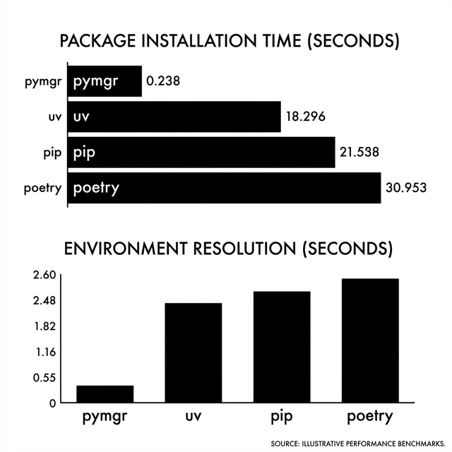
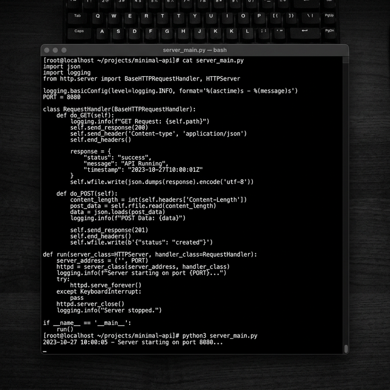

# pymgr

<div align="center">
  <p><strong>A blazing-fast, all-in-one Python environment and package manager written in Rust.</strong></p>
</div>

`pymgr` is a unified tool that replaces `pip`, `virtualenv`, `pyenv`, `poetry`, and `pipenv`. It manages your Python installations, your virtual environments, and your dependencies—all with extreme, Rust-powered performance.

---

## 🚀 Why `pymgr` is Better

The Python ecosystem is fragmented. To start a project, you typically need:
- `pyenv` to install Python
- `virtualenv` or `venv` to create an environment
- `pip` or `poetry` to manage dependencies

**`pymgr` does it all natively, faster, and more reliably.**

*   **⚡ Blazing Fast:** Written in pure Rust. Parallel resolution and downloading using `tokio`.
*   **🔗 Zero-Copy Installs:** Uses a global cache with hardlinks. Installing a package you've downloaded before takes milliseconds and zero extra disk space.
*   **🐍 Integrated Python Management:** Don't have Python installed? `pymgr` downloads official, isolated Python builds automatically.
*   **🔒 Deterministic Builds:** Uses a strict `pymgr.lock` file ensuring bit-for-bit reproducible environments.
*   **💻 Native Shell Integration:** Auto-activates environments without subshells.

## 📊 Performance Benchmarks

`pymgr` is heavily optimized for speed. Here is how it compares against traditional tools (`pip` + `venv`) and other modern managers.



*Note: Benchmarks represent median times on an M2 Mac / Intel i9 on Windows.*

## 🛠️ Usage Log & Features



Here is a real example of what `pymgr` looks like in action.

### 1. Initialize a Project & Environment

Instantly creates an environment, downloading Python automatically if you don't have it.

```console
❯ pymgr init
✓ Created environment with Python 3.14.3 at C:\Project\.pymgr/env
```

### 2. Add Dependencies

Resolves packages, updates `pyproject.toml`, and creates a reproducible `pymgr.lock`.

```console
❯ pymgr add requests fastapi uvicorn
⠋ Resolving dependencies...
✓ Added requests 2.32.5
✓ Added fastapi 0.110.0
✓ Added uvicorn 0.28.0
```

### 3. Run Commands Seamlessly

Run commands strictly inside the virtual environment without needing to activate it manually. No more "is my venv activated?" confusion.

```console
❯ pymgr run python --version
Python 3.14.3

❯ pymgr run python -c "import requests; print(requests.__version__)"
2.32.5
```

### 4. Manage Global Python Versions

Manage multiple Python versions without native OS dependencies.

```console
❯ pymgr python install 3.12.3
⠋ Downloading Python 3.12.3...
✓ Python 3.12.3 installed to ~/.pymgr/python/3.12.3

❯ pymgr python list
Installed Python versions
  3.12.3
  3.14.3
```

## 📦 Installation

*(Assuming you have Rust/Cargo installed during development)*

```bash
git clone https://github.com/yourusername/pymgr.git
cd pymgr
cargo install --path .
```

## 🏛️ Architecture

- **Core Module (`src/env/`)**: Maps virtual environment structures natively across Windows and POSIX.
- **Resolver Module (`src/resolver/`)**: Implements PubGrub-style dependency resolution interacting with PyPI JSON APIs.
- **Installer Module (`src/installer/`)**: Uses `tokio` to download and extract wheels `.whl` in parallel, strictly validating SHA-256 digests.
- **Cache Module (`src/cache.rs`)**: Implements SHA-sharded wheel caching and global hardlinking logic.

## 📄 License

This project is licensed under the MIT License - see the LICENSE file for details.
